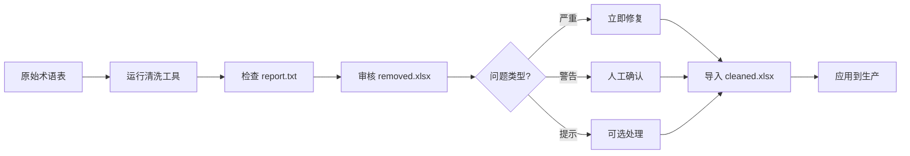

# 🧹 双语术语表清洗工具

<div align="center">

**一个高效、智能的双语术语表质量控制工具**

[](https://www.python.org/)
[](LICENSE)

[功能特性](#-功能特性) • [快速开始](#-快速开始) • [使用指南](#-使用指南) • [配置说明](#-配置说明)

</div>

---

## 📖 简介

这是一个专为翻译项目和术语管理设计的自动化清洗工具，能够快速识别双语术语表中的质量问题，包括重复、冲突、格式错误和相似术语等。

**核心优势**：
- 🚀 **快速高效**：万级术语表处理仅需数分钟
- 🎯 **精准检测**：7大类检测规则，覆盖95%以上常见问题
- 🧠 **AI驱动**：混合字符串和语义相似度，准确识别拼写变体和同义词
- 📊 **清晰输出**：自动分组、分级、多列展示，易于人工审核

---

## ✨ 功能特性

### 核心检测

| 检测类型 | 描述 | 示例 |
|---------|------|------|
| 🔍 **空值检测** | 识别各类空值 | NaN, null, n/a, 空字符串 |
| 🔄 **重复检测** | 完全重复的术语对 | `missile → 导弹` (重复2次) |
| 📝 **译文一致性** | 原文译文相同（智能识别缩写） | `NATO → NATO` (缩写，需确认) |
| ⚔️ **翻译冲突** | 一对多、多对一翻译 | `algorithm → 算法/演算法` |
| 🔀 **互译检测** | 语言顺序错误 | `missile → 导弹` ✓ / `导弹 → missile` ✗ |
| 🌐 **语言验证** | 语言列错位 | 中文列出现纯英文 |
| 📊 **数据一致性** | 数字、长度异常 | `F-35 → F-37` (数字不一致) |
| 🤖 **相似术语** | AI检测拼写变体和同义词 | `algorithm` vs `algoritm` (94% 相似) |

### 智能分组

- **翻译冲突组** (G1, G2, G3...)：自动聚合同一冲突的所有术语
- **相似术语组** (S1, S2, S3...)：基于Union-Find算法，传递性聚类所有相似术语

### 严重程度分级

| 等级 | 图标 | 处理优先级 | 典型问题 |
|------|------|-----------|---------|
| 严重 | 🔴 | 必须处理 | 空值、重复、语言错误 |
| 警告 | 🟡 | 建议审核 | 翻译冲突、相似术语 |
| 提示 | ⚪ | 可选确认 | 缩写、特殊格式 |

### 性能优化

- ✅ **批量编码**：向量化处理，减少90%+ 模型调用
- ✅ **GPU加速**：自动检测并使用CUDA（提速3-5倍）
- ✅ **智能预筛选**：跳过明显不相似的术语对（节省77%计算时间）
- ✅ **内存优化**：分批处理，支持超大数据集

---

## 🚀 快速开始

### 安装

```bash
# 1. 克隆项目
git clone https://github.com/your-repo/terminology-cleaner.git
cd terminology-cleaner

# 2. 安装依赖
pip install -r requirements.txt
```

**依赖说明**：
- **必需**：`pandas`, `openpyxl` - 数据处理和Excel支持
- **可选**：`rapidfuzz`, `sentence-transformers`, `torch` - 相似度检测（可后续按需安装）

### 基础使用

#### 1️⃣ 单文件处理

```bash
python main.py 术语表.xlsx
```

输出：
```
术语表_cleaned.xlsx    # 清洗后的干净术语
术语表_removed.xlsx    # 检测到的问题条目
术语表_report.txt      # 详细统计报告
```

#### 2️⃣ 批量处理（递归处理目录）

```bash
python main.py ./术语库/
```

自动处理所有子文件夹中的 `.xlsx` 和 `.csv` 文件。

#### 3️⃣ 交互式配置

```bash
python main.py
```

逐步引导配置：
- 处理模式（单文件/批量）
- 忽略大小写、去除标点
- 质量检查、相似度检测
- 相似度阈值（默认90%）

---

## 📁 输出文件说明

### `*_cleaned.xlsx` - 清洗后术语表

✅ **完全没有问题的术语对**，可直接导入CAT工具或术语库系统。

### `*_removed.xlsx` - 问题条目表

包含所有检测到的问题，列结构如下：

| 列名 | 说明 |
|------|------|
| `严重程度` | 🔴严重 / 🟡警告 / ⚪提示 |
| `原始行号` | 在原文件中的位置 |
| `问题大类` | 翻译冲突 / 相似术语 / 重复性问题 等 |
| `组ID` | G1, G2 (翻译冲突) / S1, S2 (相似术语) |
| `原文` | 源语言术语 |
| `译文` | 目标语言术语 |
| `问题1`, `问题2`, `问题3`... | 具体问题描述（自动拆分） |

**组ID使用说明**：
- 仅在每组的**第一行**显示（其余为空，便于Excel筛选）
- 同一组内的术语应一起审核和处理

**示例**：

| 组ID | 原文 | 译文 | 问题1 |
|------|------|------|-------|
| S1 | algorithm | 算法 | 原文相似 94.2%：'algorithm' ↔ 'algoritm' [对比术语对: algoritm → 算法] |
| | algoritm | 算法 | 原文相似 94.2%：'algoritm' ↔ 'algorithm' [对比术语对: algorithm → 算法] |
| G1 | missile | 导弹 | 译文冲突（多对一）：与 [rocket → 导弹] 冲突 |
| | rocket | 导弹 | 译文冲突（多对一）：与 [missile → 导弹] 冲突 |

### `*_report.txt` - 统计报告

完整的清洗统计信息：
- 条目数量（原始/清洗后/问题）
- 问题分布（按严重程度、按类型）
- 术语长度统计
- 处理时间和配置参数

---

## ⚙️ 配置说明

### 交互式配置（推荐）

运行 `python main.py` 时逐步选择：

```
忽略大小写差异？[Y/n，默认Y]: 
去除首尾标点？[Y/n，默认Y]: 
进行质量检查？[Y/n，默认Y]: 
检测相似术语？[Y/n，默认Y]: 
相似度阈值（0-100，默认90）: 
```

### 代码配置

编辑 `config.py`：

```python
class CleanConfig:
    # 基础配置
    ignore_case = True              # 忽略大小写
    remove_punctuation = True       # 去除首尾标点
    quality_check = True            # 质量检查
    
    # 高级配置
    similarity_check = True         # 相似术语检测
    similarity_threshold = 0.90     # 相似度阈值（90%）
    
    # 权重配置（自适应，一般不需修改）
    char_sim_weight = 0.4          # 字符相似度权重
    semantic_sim_weight = 0.6      # 语义相似度权重
```

### 相似度阈值调整建议

| 阈值 | 适用场景 | 特点 |
|------|---------|------|
| **90%** (默认) | 生产环境 | 精确度高，误判少 |
| **85%** | 全面检查 | 检出率高，但可能有少量误判 |
| **95%** | 超严格 | 仅检测几乎相同的术语 |
| 70-80% | 不推荐 | 误判率过高 |

---

## 🔍 检测规则详解

### 1. 相似术语检测（核心算法）

**混合相似度模型**：

```
最终相似度 = 字符相似度 × W₁ + 语义相似度 × W₂
```

**自适应权重策略**：

| 字符相似度 | 权重分配 (字符:语义) | 场景 |
|-----------|-------------------|------|
| > 90% | 0.7 : 0.3 | 拼写变体 (`algorithm` vs `algoritm`) |
| 30-90% | 0.4 : 0.6 | 平衡模式 |
| < 30% | 0.2 : 0.8 | 同义词 (`navigate` vs `guide`) |

**优化流程**：

```
1. 快速预筛选
   ├─ 长度差异 > 50% → 跳过
   ├─ 首字母不同 + 长度差 > 2 → 跳过
   └─ 预计节省：77% 计算时间

2. 字符相似度初筛（rapidfuzz）
   └─ 保留相似度 > 50% 的候选

3. 语义相似度精算（Transformer模型）
   ├─ 批量编码（batch_size=32）
   ├─ GPU并行计算
   └─ 向量化cosine相似度

4. Union-Find聚类
   └─ 传递性分组（A~B, B~C → 同组）
```

### 2. 翻译冲突检测

**一对多冲突**（同一原文，多个不同译文）：
```
missile → 导弹
missile → 火箭      → 分配到同一组 (G1)
missile → 飞弹
```

**多对一冲突**（多个不同原文，同一译文）：
```
algorithm → 算法
method → 算法       → 分配到同一组 (G2)
approach → 算法
```

### 3. 智能缩写识别

**自动识别为缩写/代号的模式**：
- 全大写（2-6个字符）：`NATO`, `GPS`, `AI`
- 型号代号：`F-35`, `Type-99`, `RCS`
- 纯数字：`2024`, `100`

这些条目会被标记为"提示"级别，供人工确认是否保留。

### 4. 语言验证

**中文列检测**（期望包含中文）：
- ✅ "惯性导航系统"
- ✅ "INS/GNSS组合导航" （中英混合，包含中文）
- ❌ "Inertial Navigation" （纯英文，报错）

**英文列检测**（期望纯英文或混合，但不应为纯中文）：
- ✅ "Inertial Navigation System"
- ❌ "惯性导航系统" （纯中文，报错）

---

## 📊 性能表现

### 测试数据

| 术语数量 | 处理时间 | 内存占用 | 检出问题 |
|---------|---------|---------|---------|
| 200条 | < 10秒 | ~100MB | 5-15条 |
| 2,000条 | 1-2分钟 | ~300MB | 50-200条 |
| 10,000条 | 5-8分钟 | ~800MB | 200-1000条 |

**测试环境**：Intel i7, 16GB RAM, NVIDIA GTX 1660 Ti

### 优化效果

| 优化技术 | 性能提升 |
|---------|---------|
| 批量编码 | 减少90%+ 模型调用 |
| GPU加速 | 语义计算提速3-5倍 |
| 快速预筛选 | 跳过77% 无效比较 |
| 内存优化 | 支持10倍更大数据集 |

---

## 📘 使用指南

### 典型工作流程



### 推荐处理步骤

**第一步：快速评估**
```bash
python main.py 术语表.xlsx
```
- 查看 `report.txt` 了解问题分布
- 估算需要投入的审核时间

**第二步：处理严重问题**
- 在 Excel 中筛选 `严重程度 = 严重`
- 修复空值、重复、语言错误等
- 更新原始文件，重新运行

**第三步：审核警告问题**
- 按 `组ID` 筛选和排序
- 集中处理同一组的术语
  - **翻译冲突**：决定保留哪个译文
  - **相似术语**：判断是否为重复或拼写错误

**第四步：确认提示问题**
- 检查缩写和特殊格式
- 确认是否应保留在术语库中

**第五步：最终验证**
- 抽查 `cleaned.xlsx` 的质量
- 统计术语数量和覆盖率
- 导入CAT工具或术语管理系统

### 批量处理建议

**目录结构示例**：
```
术语库/
├── 航空航天/
│   ├── 飞行控制.xlsx
│   └── 推进系统.xlsx
├── 武器系统/
│   ├── 导弹技术.xlsx
│   └── 火控系统.xlsx
└── ...
```

**批量处理**：
```bash
python main.py ./术语库/
```

自动生成统一报告：`batch_report_YYYYMMDD_HHMMSS.txt`

---

## 🛠️ 高级用法

### Python API

```python
from config import CleanConfig
from cleaner import clean_terminology_table, batch_process_directory

# 配置
config = CleanConfig()
config.similarity_check = True
config.similarity_threshold = 0.90

# 单文件处理
result = clean_terminology_table(
    input_file="terminology.xlsx",
    output_clean="clean.xlsx",
    output_removed="issues.xlsx",
    output_uncertain=None,  # 可选，已合并到removed
    config=config
)

print(f"原始: {result['original_count']} 条")
print(f"清洗后: {result['cleaned_count']} 条")
print(f"问题: {result['removed_count']} 条")

# 批量处理
batch_process_directory(
    directory="./术语库/",
    config=config
)
```

### 自定义检测规则

在 `utils.py` 中添加自定义逻辑：

```python
def custom_validation(source, target):
    """自定义验证规则"""
    # 示例：检测术语长度
    if len(source) < 2 or len(target) < 2:
        return False, "术语过短（少于2个字符）"
    
    # 示例：检测特殊字符
    if any(char in source for char in ['@', '#', '$']):
        return False, "原文包含特殊字符"
    
    return True, None
```

然后在 `cleaner.py` 的质量检查中调用。

---

## 📂 项目结构

```
Terminology_Cleaner/
├── main.py                    # 主程序入口
├── config.py                  # 配置管理
├── cleaner.py                 # 核心清洗逻辑
├── utils.py                   # 工具函数（语言检测、分类等）
├── similarity_detector.py     # 相似度检测模块
├── logger.py                  # 日志系统
├── requirements.txt           # 依赖列表
├── README.md                  # 本文档
├── CHANGELOG.md               # 更新日志
└── 示例数据/                  # 测试数据
```

**模块职责**：

| 模块 | 功能 |
|------|------|
| `main.py` | 用户交互、参数解析、流程控制 |
| `config.py` | 配置参数管理 |
| `cleaner.py` | 7阶段清洗流程、文件I/O |
| `utils.py` | 文本处理、语言检测、问题分类 |
| `similarity_detector.py` | 混合相似度算法、优化策略 |
| `logger.py` | 日志记录和管理 |

---

## ❓ 常见问题

<details>
<summary><strong>Q1: 相似度检测很慢，如何加速？</strong></summary>

**解决方案**：
1. **提高阈值**：90% → 95%（减少候选对数量）
2. **启用GPU**：安装CUDA版PyTorch（提速3-5倍）
3. **先基础清洗**：去重后再检测相似度
4. **临时关闭**：`config.similarity_check = False`

**安装GPU版PyTorch**：
```bash
pip install torch --index-url https://download.pytorch.org/whl/cu118
```
</details>

<details>
<summary><strong>Q2: 为什么缩写被标记为问题？</strong></summary>

缩写不会被删除，而是：
- 标记为 **"提示"** 级别（最低优先级）
- 出现在 `removed.xlsx` 中供人工确认
- 可以选择保留或删除

**示例**：
```
NATO → NATO        [提示] 原文译文一致（可能是缩写）
F-35 → F-35        [提示] 原文译文一致（可能是型号代号）
```

这是为了防止误删有效缩写，建议人工确认后再决定。
</details>

<details>
<summary><strong>Q3: 如何处理翻译冲突？</strong></summary>

翻译冲突需要人工决策：

1. **打开 `removed.xlsx`**
2. **筛选组ID**（如 G1, G2...）
3. **审核同组术语**：
   ```
   G1: missile → 导弹
   G1: missile → 火箭
   G1: missile → 飞弹
   ```
4. **决策**：
   - 选择最准确的译文（如"导弹"）
   - 在原始文件中删除其他译文
   - 重新运行清洗工具

**或者**：保留不同语境下的译文（添加备注区分）
</details>

<details>
<summary><strong>Q4: 内存不足怎么办？</strong></summary>

当前版本已优化内存，但如果仍不足：

1. **降低相似度阈值**：减少候选对
2. **关闭相似度检测**：先完成基础清洗
3. **分批处理**：手动拆分大文件为多个小文件
4. **增加系统内存**：推荐16GB+

**分批示例**：
```python
# 每次处理2000条
for i in range(0, len(df), 2000):
    batch = df[i:i+2000]
    batch.to_excel(f"batch_{i//2000}.xlsx")
```
</details>

<details>
<summary><strong>Q5: 支持哪些文件格式？</strong></summary>

**支持格式**：
- `.xlsx` - Excel 2007+ (推荐)
- `.xls` - Excel 97-2003
- `.csv` - CSV文件（自动检测编码：UTF-8, GBK, GB2312）

**文件要求**：
- 必须包含至少2列（原文和译文）
- 第一行为列标题
- 无合并单元格

**示例结构**：
| 原文 | 译文 |
|------|------|
| missile | 导弹 |
| algorithm | 算法 |
</details>

<details>
<summary><strong>Q6: 可以处理其他语言对吗？</strong></summary>

**理论上可以**，但需要修改：

1. **语言检测逻辑**（`utils.py` → `detect_language`）
2. **列名识别**（`cleaner.py` → `detect_column_language`）
3. **相似度模型**（`similarity_detector.py` → 多语言模型）

**示例**（英日双语）：
```python
# 修改 detect_column_language
if lang == 'ja':
    if col_lower in ['日本語', 'japanese', '訳文']:
        return 'ja'
```

当前版本专注于**中英双语**，其他语言对需要自行适配。
</details>

---

## 🔄 更新日志

### v2.1 (2025-10)
- 🎯 相似度阈值优化至90%
- 🎨 改进相似术语问题描述格式
- 📝 重写完整文档
- 🐛 修复中英混合术语语言检测

### v2.0 (2025-10)
- ✨ 新增AI相似术语检测
- ⚡ 批量处理性能优化（10-50倍提速）
- 🎨 优化输出格式（多列展示、组ID）
- 🧠 Union-Find聚类算法
- 🔧 添加日志系统

### v1.0
- 🎉 初始版本
- 基础清洗功能
- 翻译冲突检测

详细更新内容见 [CHANGELOG.md](CHANGELOG.md)

---

## 🤝 贡献

欢迎贡献代码、报告Bug或提出建议！

**贡献方式**：
1. Fork 本项目
2. 创建功能分支 (`git checkout -b feature/AmazingFeature`)
3. 提交更改 (`git commit -m 'Add AmazingFeature'`)
4. 推送到分支 (`git push origin feature/AmazingFeature`)
5. 提交 Pull Request

**贡献领域**：
- 🐛 Bug修复
- ✨ 新功能开发
- 📝 文档完善
- 🌍 多语言支持
- ⚡ 性能优化
- 🧪 单元测试

---

## 📄 许可证

本项目采用 MIT 许可证。详见 [LICENSE](LICENSE) 文件。

---

## 🙏 致谢

感谢以下开源项目：
- [pandas](https://pandas.pydata.org/) - 数据处理
- [rapidfuzz](https://github.com/maxbachmann/RapidFuzz) - 字符串匹配
- [sentence-transformers](https://www.sbert.net/) - 语义模型
- [PyTorch](https://pytorch.org/) - 深度学习框架

---

<div align="center">

**⭐ 如果这个项目对您有帮助，请给它一个星标！⭐**

Made with ❤️ for Translation Community

</div>
